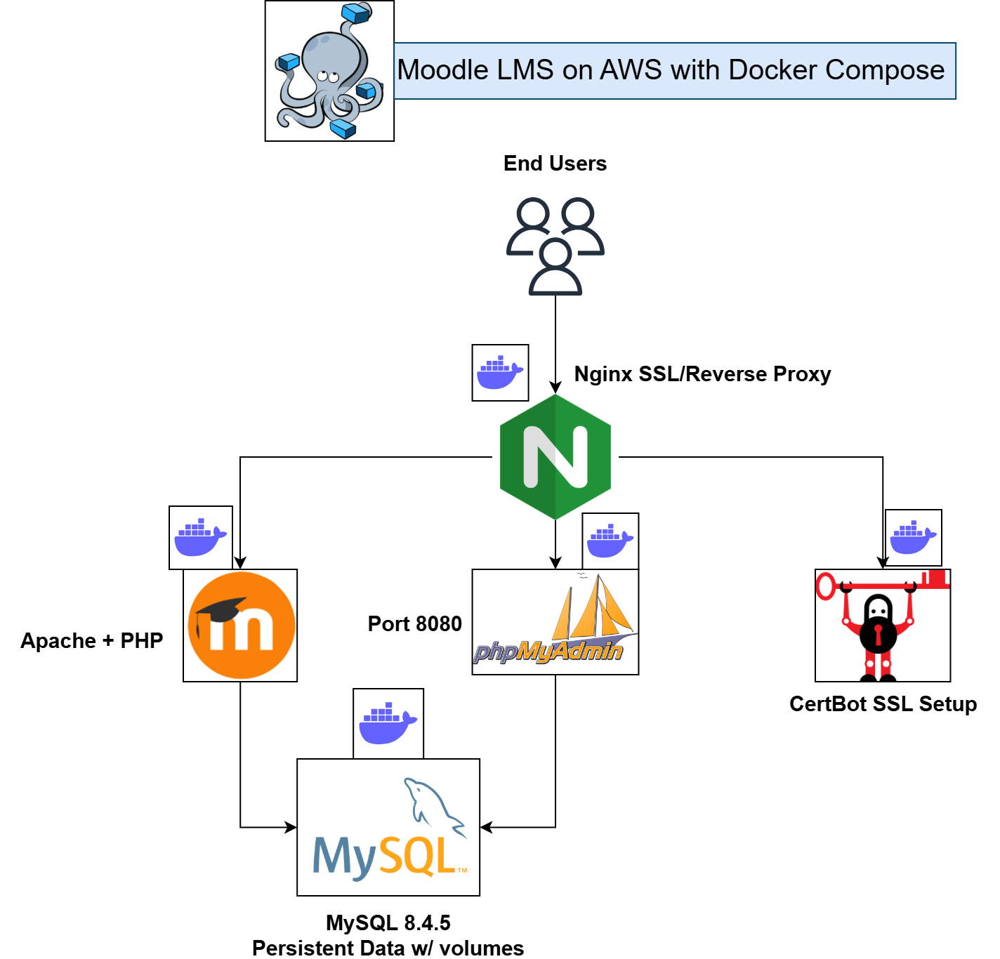

# Moodle LMS on AWS with Docker Compose

[](https://www.docker.com/)
[](https://moodle.org/)
[](https://www.mysql.com/)
[](https://nginx.org/)
[](https://letsencrypt.org/)
[](https://aws.amazon.com/ec2/)

This project deploys a **Moodle Learning Management System (LMS)** on an **AWS EC2 instance (t3.medium)** using Docker Compose. It was designed to support an online exam setup for **200–500 concurrent users**.

The deployment includes a custom Moodle Docker image (built from the [Moodle Git repository](https://docs.moodle.org/500/en/Git_for_Administrators)), MySQL database, phpMyAdmin for database management, Nginx as a reverse proxy, and Let’s Encrypt SSL via Certbot.

## 🚀 Project Overview

* **Moodle Service**: Custom Docker image (`oluwaseuna/runmoodle:1.4`) with an `entrypoint.sh` script that dynamically generates `config.php` using environment variables and secret files.
* **Database**: MySQL 8.4.5 with persistent storage via Docker named volumes.
* **phpMyAdmin**: Database management tool to interact with Moodle’s MySQL database.
* **Nginx**: Reverse proxy with SSL termination.
* **Certbot**: Automated SSL certificate issuance from Let’s Encrypt.

This architecture ensures a **secure, scalable, and production-ready Moodle LMS** deployment.

## 🏗️ Architecture



## 📦 Services

### 1. Moodle Service

* Custom Docker image (`oluwaseuna/runmoodle:1.4`).
* Runs Apache + PHP with Moodle codebase.
* Uses **entrypoint.sh** to auto-generate `config.php` at container startup.
* Persists uploaded files and cache in `moodleData` volume.

### 2. MySQL Database

* MySQL 8.4.5 container.
* Stores Moodle database.
* Persists data in `cloudDBdata` volume.
* Reads root and user passwords from secret files in `./secrets/`.

### 3. phpMyAdmin

* Runs on port **8080**.
* Allows DB administrators to log in with MySQL credentials.
* Depends on `moodleDB` to be available.

### 4. Nginx

* Acts as reverse proxy.
* Forwards traffic to Moodle and phpMyAdmin.
* Handles ports **80** and **443**.
* Uses bind mounts:

  * `/home/ssm-user/nginx/conf.d`
  * `/home/ssm-user/nginx/html`
  * `/home/ssm-user/letsencrypt`

### 5. Certbot

* Obtains SSL certificates from Let’s Encrypt.
* Shares the same bind mounts as Nginx for certificate storage.
* Runs once to issue certificates, then exits.

## 🔑 Secrets Management

Instead of Docker secrets, this setup uses **plain text secret files** stored locally inside a `secrets/` folder:

```bash
mkdir secrets
echo "secure_root_password" > secrets/db_root_password.txt
echo "secure_db_password" > secrets/db_password.txt
```

In `compose.yml`, these files are mounted and read by MySQL and Moodle containers.

## ⚙️ Deployment

### Prerequisites

* AWS EC2 **t3.medium** instance (Ubuntu 24).
* **AmazonSSMManagedInstanceCore** IAM role attached to the instance profile (for Systems Manager Session Manager access instead of SSH).
* Domain name pointing to EC2 public IP.
* Docker & Docker Compose installed.

### Steps

1. **Clone Repository**

   ```bash
   git clone https://github.com/seunayolu/moodle-docker-compose.git
   cd moodle-docker-compose
   ```

2. **Prepare Environment Variables**
   Create a `.env` file:

   ```bash
   MYSQL_DATABASE=moodle
   MYSQL_USER=moodleuser
   ```

3. **Create Secret Files**

   ```bash
   mkdir secrets
   echo "secure_root_password" > secrets/db_root_password.txt
   echo "secure_db_password" > secrets/db_password.txt
   ```

4. **Prepare Bind Mount Directories**

   ```bash
   mkdir -p /home/ssm-user/nginx/conf.d /home/ssm-user/nginx/html /home/ssm-user/letsencrypt
   ```

5. **Start Services**

   ```bash
   docker compose up -d
   ```

6. **Access Services**

   * Moodle LMS → `https://moodle.teachdev.online`
   * phpMyAdmin → `http://<EC2-IP>:8080`

## 📝 Understanding `entrypoint.sh`

The `entrypoint.sh` script is responsible for **configuring Moodle automatically** when the container starts. Let’s break it down step by step:

```bash
#!/bin/bash
set -e
```

* Uses **bash shell**.
* `set -e` → stop immediately if any command fails.

```bash
MOODLE_DIR=/var/www/html
MOODLE_CONFIG=$MOODLE_DIR/config.php
MOODLE_DATA=/var/www/moodledata
```

* Defines paths for Moodle code, config file, and data directory.

```bash
if [ ! -f "$MOODLE_CONFIG" ]; then
  echo "Generating Moodle config.php..."
  DB_PASS="$(cat "$MOODLE_DATABASE_PASSWORD_FILE")"
```

* Checks if `config.php` already exists.
* If not, it **creates one**.
* Reads DB password securely from a file (`/run/secrets/...` or mounted file).

```php
  cat > "$MOODLE_CONFIG" <<EOF
<?php
unset(\$CFG);
global \$CFG;
\$CFG = new stdClass();
...
EOF
```

* Writes a fresh **Moodle config.php** with PHP settings.
* Sets database connection, site URL (`wwwroot`), and data directory.

```php
\$CFG->sslproxy  = true;
```

* Tells Moodle it’s running behind an SSL-terminating proxy (Nginx).

```bash
else
  echo "Moodle config.php already exists — skipping generation."
fi
```

* If config already exists → skip regeneration (avoids overwriting).

```bash
exec apache2-foreground
```

* Finally, starts the Apache web server in the foreground → keeps the container alive.

👉 In simple terms:
**“On first run, generate Moodle’s config file from environment variables and secrets, then start Apache. On later runs, skip config generation and just start Apache.”**

## 🛡️ Security Notes

* Secrets are stored in local files (`./secrets`) and not hardcoded.
* SSL certificates auto-renew with Certbot.
* Restrict phpMyAdmin access (firewall or security groups).
* Use AWS SSM Session Manager for secure access instead of SSH.

## 🔗 Useful Links

* [Moodle Git Repository](https://docs.moodle.org/500/en/Git_for_Administrators)
* [Certbot Docker Image](https://hub.docker.com/r/certbot/certbot)
* [Certbot Documentation](https://eff-certbot.readthedocs.io/en/latest/install.html#running-with-docker)

## 📌 Author

**Oluwaseun Alausa**
DevOps Engineer | Enabling Secure, Scalable, and Observable Infrastructure
🚀 [LinkedIn](https://www.linkedin.com/in/alausa-oluwaseun) | [YouTube](https://www.youtube.com/@alausaseun)